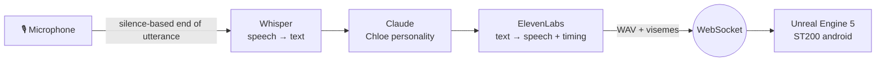

<div align="center">

# Chloe ST200 — Voice AI Android

**A CyberLife ST200 android (Detroit: Become Human) you can actually talk to.**
Whisper hears you, Claude thinks as Chloe, ElevenLabs gives her a voice, and Unreal Engine 5 moves her lips in sync.


</div>

## 🧠 How it works



1. **Listen**: `sounddevice` streams the mic; an RMS + silence-duration gate decides when you've finished talking.
2. **Understand**: the utterance goes to OpenAI **Whisper** for transcription.
3. **Think**: an async **Claude** call answers in character, driven by a dedicated personality prompt (`Prompts/chloe_personality.txt`).
4. **Speak**: **ElevenLabs** synthesises the reply; its character-level alignment is converted into **visemes** for lip-sync.
5. **Perform**: a WebSocket server pushes the audio path + viseme track to a C++ WebSocket client inside **Unreal Engine 5**, which drives the android.

## 📁 Structure

```
ChloeAI/
├── Backend/
│   ├── main.py              # mic loop + orchestration
│   ├── stt.py               # Whisper speech-to-text
│   ├── brain.py             # Claude chat, Chloe persona
│   ├── tts.py               # ElevenLabs TTS + alignment
│   ├── audio_utils.py       # WAV encoding, alignment → visemes
│   └── websocket_server.py  # bridge to Unreal
├── Prompts/chloe_personality.txt
├── UnrealHelpers/           # C++ WebSocket client for UE5
└── Docs/setup.md            # full setup guide (TR)
Chloe_ST200.uproject         # Unreal Engine 5 project
```

## 🚀 Getting Started

```powershell
cd ChloeAI
python -m venv .venv
.\.venv\Scripts\Activate.ps1
pip install -r Backend\requirements.txt
copy Backend\.env.example Backend\.env   # add your keys
python -m Backend.main
```

Then open `Chloe_ST200.uproject` in Unreal Engine 5 and play. The backend and the editor run on the same machine.

| Variable | Purpose |
|---|---|
| `OPENAI_API_KEY` | Whisper speech-to-text |
| `ANTHROPIC_API_KEY` | Claude (Chloe's brain) |
| `ELEVENLABS_API_KEY`, `ELEVENLABS_VOICE_ID` | Chloe's voice |
| `CLAUDE_MODEL`, `WHISPER_MODEL`, `WS_PORT`, … | Optional overrides, see `.env.example` |

---

<div align="center"><sub>Built by <a href="https://github.com/Tguleryuz52">Talha Güleryüz</a> · fan project, not affiliated with Quantic Dream</sub></div>
